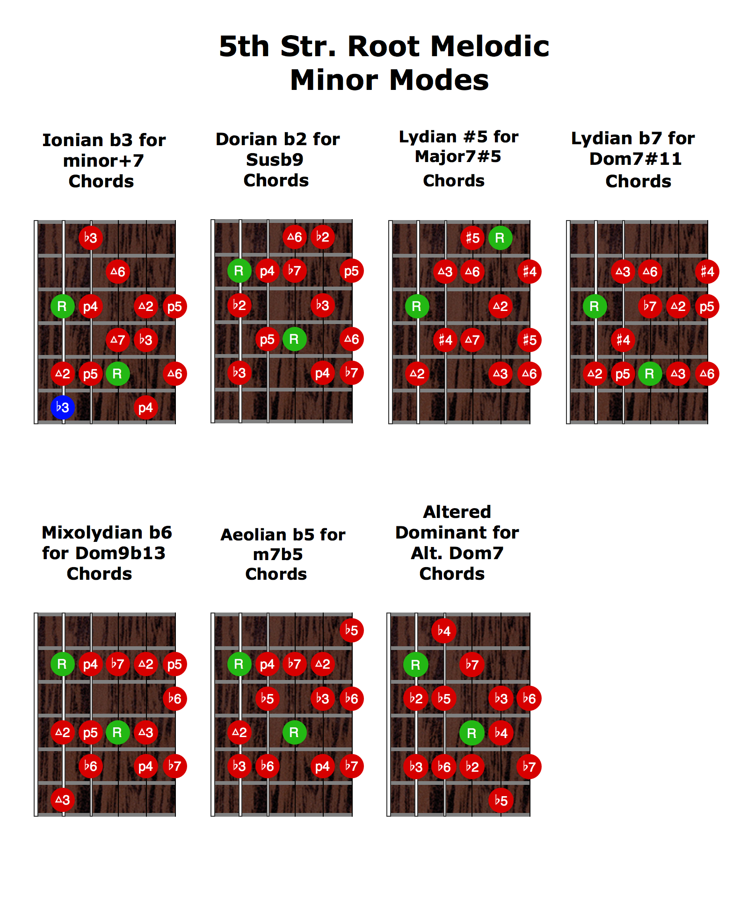

# Melodic minor modes

The seven modes derived from the ascending [[melodic minor scale]],
arranged here as fretboard shapes from two root strings.

## Fretboard charts

6th-string root (low E):

5th-string root (A):

## Mode list

1. Melodic minor (1 2 ♭3 4 5 6 7)
2. Dorian ♭2
3. Lydian augmented
4. Lydian dominant
5. Mixolydian ♭6
6. Locrian ♮2 (a.k.a. [[Aeolian b5]])
7. Altered (super-Locrian) — see [[Altered Scaled]]

Used heavily over altered dominants — see [[Mode-of-the-moment]] for the
matching scale per chord.
