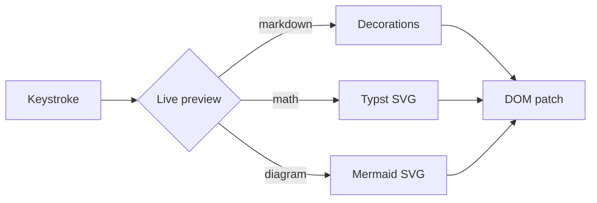
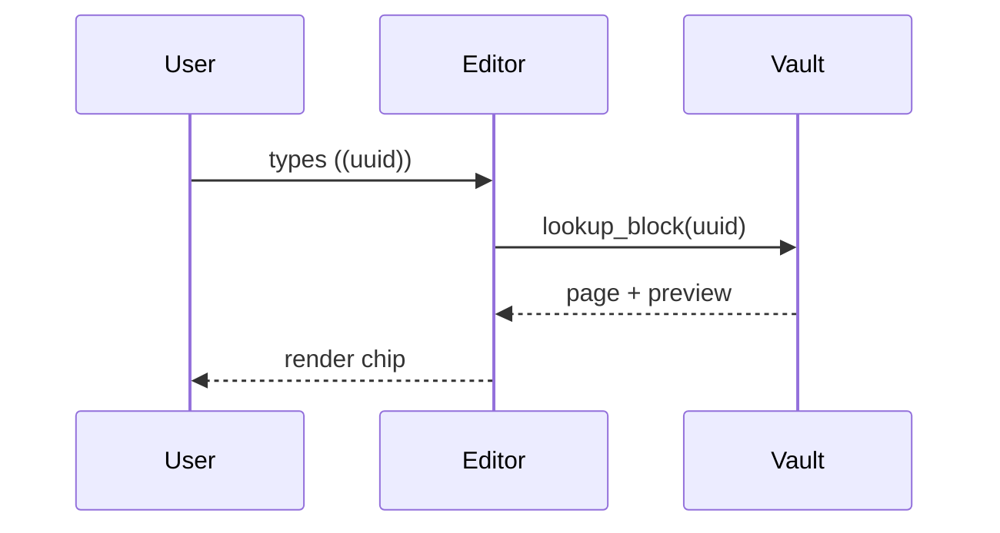
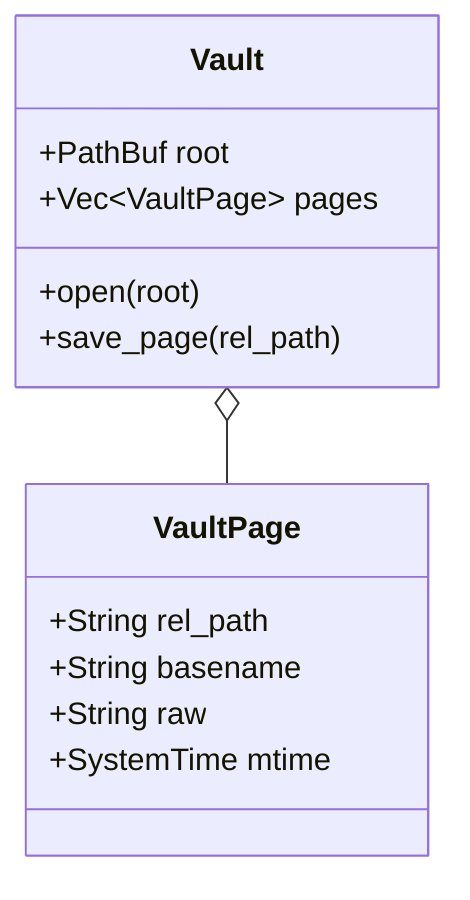

# Mermaid showcase

Mermaid renders through a vendored pure-Rust fork; SVGs use
`currentColor` so they inherit the editor theme.

## Flowchart

```mermaid
flowchart LR
  A[Keystroke] --> B{Live preview}
  B -->|markdown| C[Decorations]
  B -->|math| D[Typst SVG]
  B -->|diagram| E[Mermaid SVG]
  C --> F[DOM patch]
  D --> F
  E --> F
```

## Sequence

```mermaid
sequenceDiagram
  participant U as User
  participant E as Editor
  participant V as Vault
  U->>E: types ((uuid))
  E->>V: lookup_block(uuid)
  V-->>E: page + preview
  E-->>U: render chip
```

## Class

```mermaid
classDiagram
  class Vault {
    +PathBuf root
    +Vec~VaultPage~ pages
    +open(root)
    +save_page(rel_path)
  }
  class VaultPage {
    +String rel_path
    +String basename
    +String raw
    +SystemTime mtime
  }
  Vault o-- VaultPage
```
